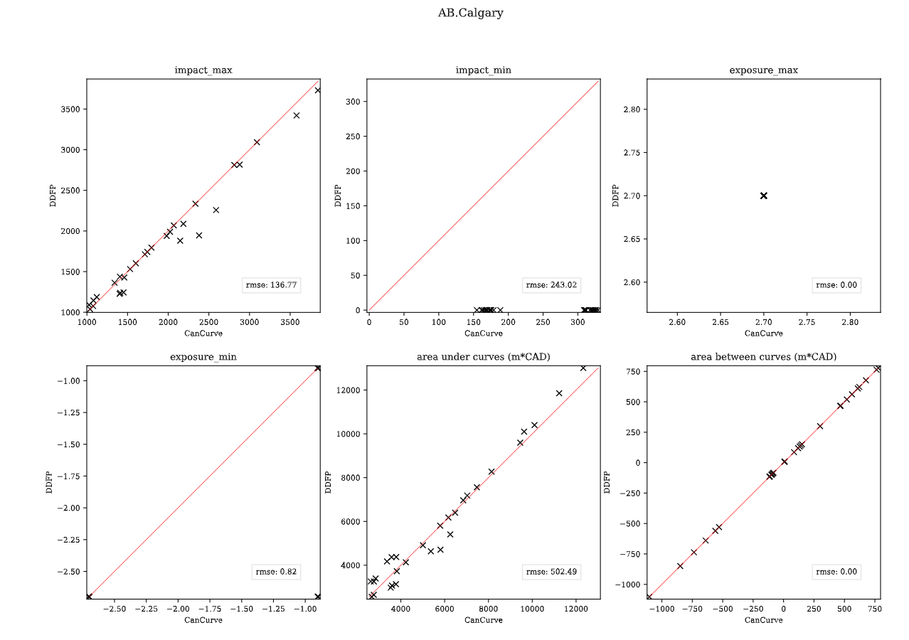

# Legacy software
Compatability and comparison betweewn CanCurve and DDFP (Program for the Development of Flood Damage (Vulnerability) Curves for buildings in Canada).

#DDFP
see [DDFP](https://github.com/cefect/DDFP) repository and readme for description.

# Philosophical differences

- DDFP is an Xactimate + Excel based workflow that is expert-oriented with a focus on reproducing Xactimate data.
- CanCurve is python-based QGIS plugin that user-oriented with a focus on simplicity and usability.

# Methodological differences

## Fixed costs and Response costs
Fixed costs are those restoration activities that are not a function of depth. e.g., mobilzation.

DDFP Uses a set of $/m2 values developed from spatiotemporal price lists (e.g., ABCA8X_SEP23; see the master rule book 'Response_Costs') for different categories (e.g., General, Kitchen/Bathroom) that are assigned to rooms then multiplied by the floor area of the room (see 'Groups-Layout').

CanCurve has a simpler approach whereby the user supplies fixed values for each storey.

## Structure-level split costs
CostLists from Xactimate often have depth-dependent costs that are not obviously assigned to a room (i.e., StructureLevelLineItems).

DDFP assigns these to the 'split' group_code, which is typically then evenly divided between the basement and the main floor (behavior is customized on the 'DDFwrk_grp2' tab). 

When using CanCurve's `misc.port_estimate.ddfp_inputs_to_ci` to extract Cost Information data from an Xactimate raw estimate file, entries without a matching `group_code` are assigned to storey=0. In other words, CanCurve requires the user to specify a unique floor for each cost item (but provides a tool for converting from Xactimate). 

# Difference evaluation
To quantitatively evaluate the difference in resulting depth-damage functions (ddf) between DDFP and CanCurve, a set of 59 scenarios from 2 study areas were computed.

## Methods 
Data for this analysis was provided on 2024-03-25 and includes the following files for each scenario:
- DDFwork_R_1-L-BD-CU_ABCA.xlsm: DDFP completed workbook
- R_1-L-BD-CU_ABCA.esx: Xactimate output file
- R_1-L-BD-CU_ABCA.xlsx: cost list
- R_1-L-BD-CU_ABCA_rep.pdf: Xactimate report pdf
- R_1-L-BD-CU_ABCA_rep.xlsx: Xactimate report pdf converted to xlsx

The evaluation was carried out using the `./misc/DDFP_compare.py` script and employed the following basic steps:
- **p01_extract_DDFP**: extract data into CanCurve format (CostItem csv, fixed costs, metadata) and extract the DDFP supplied CanFlood format ddf
- **p02_CanCurve_workflow**: compile CanCurve database and output a CanFLood format ddf
- **p03_compare**: for each scenario, compare the ddfs from DDFP and CanCurve: compute metrics and plot
- **p04_summary_plot**: create scatter plot of metrics for each study area.

## Discussion and Results
results are provided in `./eval_results`, including summary plots for each study area like the below:

   

Both the individual curve plots, and the summary plots show the two frameworks produce similar, but not identical ddfs from the same data.
Key differences include:
- DDFP curves always start with an impact of zero and a depth of -2.7, while CanCurve uses the values from the DRF database.
- some DDFP curves have a slightly lower maximum than CanCurve
Overall, the differences are minor, and far less than the uncertainty in the underlying input data (and the implicit vulnerability assumptions).
For example, where there are differences, they are generally less than 50$/m2.
This is likely attributable to DDFP's application of room-based fixed costs vs. CanCurve's storey-based fixed costs.
To provide a more robust comparison, alternate curve sets could be applied to a range of risk models; however, the utility of this would be limited without some validation data.
In summary, the methodological differences between CanCurve and DDFP result in slightly disparate depth-damage functions; however, these disparites are negligible compared to other uncertainties within a flood risk model.

